<div align="center">


<a href="https://github.com/caoxing9">
  
</a>

<br />

<a href="https://x.com/caoxing_00">
  
</a>
<a href="https://github.com/caoxing9?tab=followers">
  
</a>

</div>

---

### 👨‍💻 About me

```ts
const aries = {
  pronouns:    "he/him",
  role:        "Founder & Full-Stack Engineer",
  company:     "@teableio",
  currentWork: "Teable — a Postgres-powered Airtable alternative",
  stack:       ["TypeScript", "Node.js", "React", "PostgreSQL", "Docker"],
  philosophy:  "Build in the open. Ship with taste.",
};
```

### 🚀 Featured project

<h4>
  <a href="https://github.com/teableio/teable">Teable</a>
  — Postgres-powered no-code database, the Airtable alternative for builders
</h4>

<p>
  <a href="https://github.com/teableio/teable"></a>
  <a href="https://github.com/teableio/teable/network/members"></a>
  <a href="https://github.com/teableio/teable/issues"></a>
  <a href="https://teable.io"></a>
</p>

> Super-fast, fully featured, PostgreSQL-backed no-code database. Turning spreadsheets into real applications, for everyone.

### 📊 GitHub stats

<p align="center">
  
</p>

<p align="center">
  
</p>

### 🛠️ Tech stack

<a href="https://skillicons.dev">
  
</a>

### 🏆 Trophies


### 🐍 Contribution graph

<picture>
  <source media="(prefers-color-scheme: dark)" srcset="https://raw.githubusercontent.com/caoxing9/caoxing9/output/github-contribution-grid-snake-dark.svg" />
  <source media="(prefers-color-scheme: light)" srcset="https://raw.githubusercontent.com/caoxing9/caoxing9/output/github-contribution-grid-snake.svg" />
  
</picture>

### 📫 Let's connect

<p>
  <a href="https://x.com/caoxing_00"></a>
  <a href="mailto:caoxing9@gmail.com"></a>
  <a href="https://teable.io"></a>
  <a href="https://github.com/teableio"></a>
</p>

<div align="center">
  
</div>
